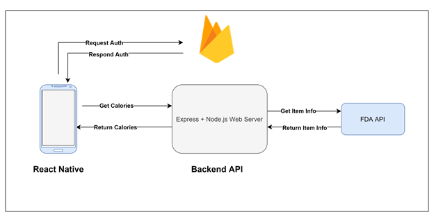

# **Recipe Mini Project**

### EC463 Fall 2021
### Team Members: Yan Chen, Hanlin Mai

=======================================

This project is about learning how to design and implement a recipe calories cross-platform mobile app in React Native. We have decided to choose React Native as our UI framework and Express + Node.js as our backend API framework. React Native is robust and cross-platform, and also supports lots of packages. Express + Node.js provides an easy setup and lightweight packages, which is also one of the fastest backend frameworks.

We also included *Github Actions* to deploy our Backend API automatically to Heroku (where we host our backend API).

* [Frontend UI Repo](https://github.com/yanchen01/recipe-mini-project-ui)
* [Backend API Repo](https://github.com/yanchen01/recipe-mini-project-api)

## Documentation
* [Architecture Diagram](architecture_diagram.png)

## Description of Home.js
1. const Container: This is the container for the whole user interface.
2. const RecipeContainer: This is the container for the receipt, which is right in the center of the APP.
3. const WelcomeText: This is the text of “Welcome, user!”.
4. const RecipeText: This contains the name of the recipe.
5. const Home: This contains the main frame of the architecture.
6. It will return the layout of our home screen.

## Description of AddRecipe.js
In this file, the main frame and the fonts for the adding recipe container are set. It allows user to input recipe name, and input the ingredients used for that recipe, in a text input or barcode scanning style.

## Description of BarcodeScanner.js
This screen allows user to scan barcode from an item and adds the barcode to a global ingredients list for global state. In this screen, we will first check whether we have permission to get access to users’ camera. If we don’t have permission, we will remind users and return text “No access to camera”. If we gain the camera’s permission, we will use the scanner to get food’s unique code string. Then we will navigate to our another API with the string and use the API to get the food’s data.

## Description of Login.js
First, we will ask the users to enter their accounts' information, which includes their e-mail addresses, passwords and usernames on this page. After they enter the information, the program will automatically connected to the authentication and check whether the data is valid or not.

## Description of Signup.js
If the users haven't registered any accounts in the database, the app will ask them to sign up for their own accounts. On this page, the program will help users to create accounts. Users will provide their full names, e-mail addresses and passwords.

## Description of LoginStyle.js & SignupStyle.js
In these two screens, we set the style for containers and the fonts inside.

## Demo Video
* [Demo Video](Demo_Video.mp4)
<video src="Demo_Video.mp4">
